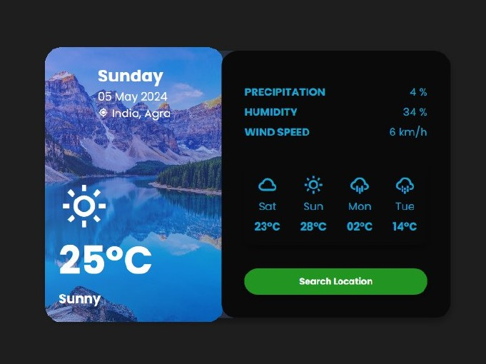

# Weather App design 
 I'm going to show you how to use modern HTML, CSS to create a weather app ui design with some animations. We'll be using CSS transitions, CSS Flexbox, float for our design, and CSS  transitions and animations for some cool animation effects.

# Sample 
Here we have project Sample :

